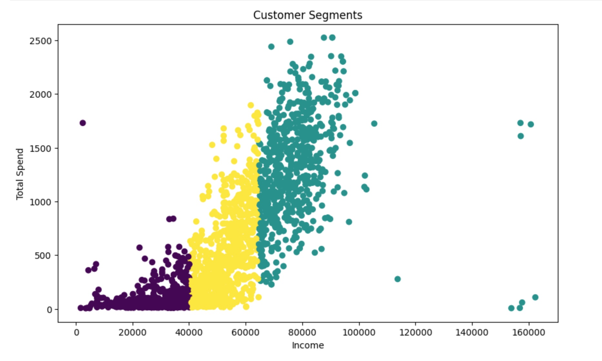
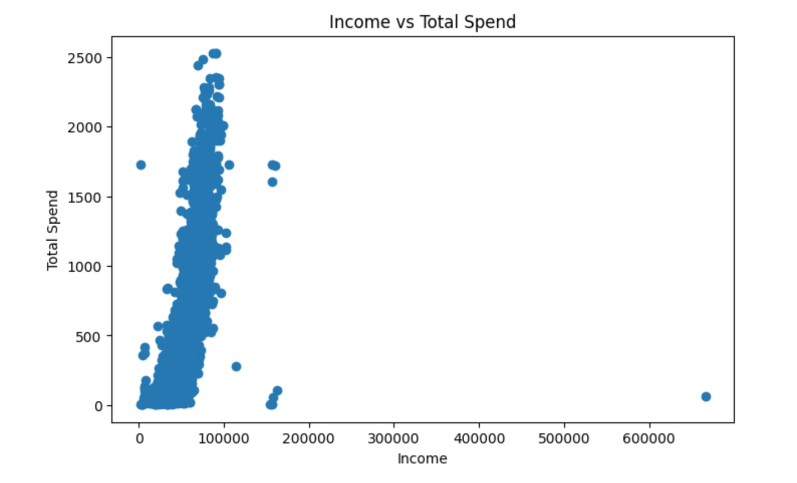
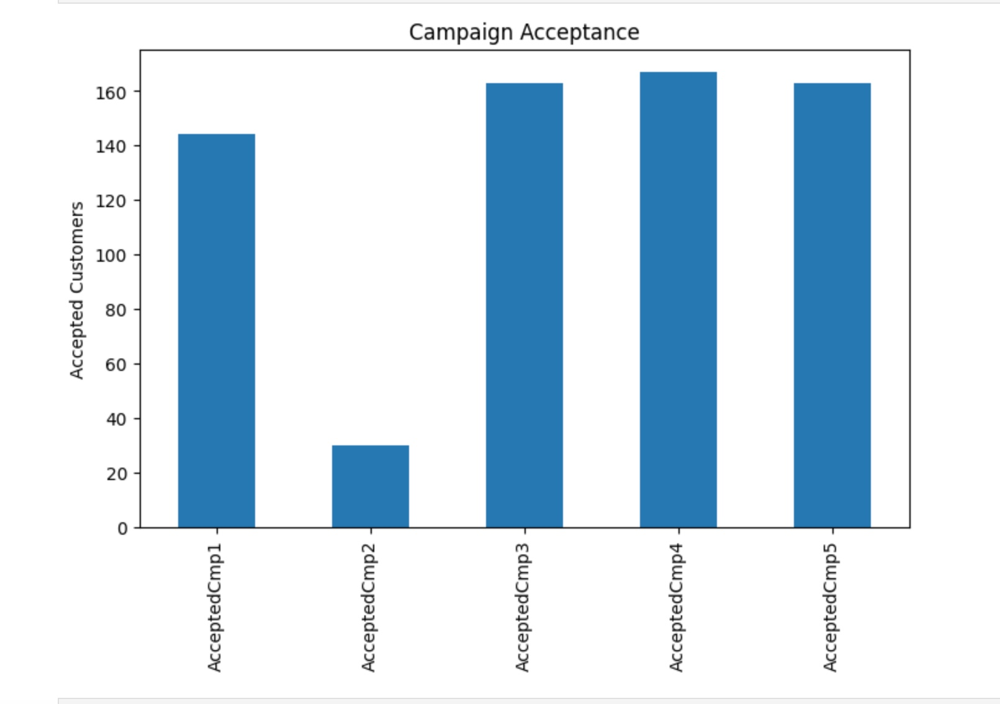
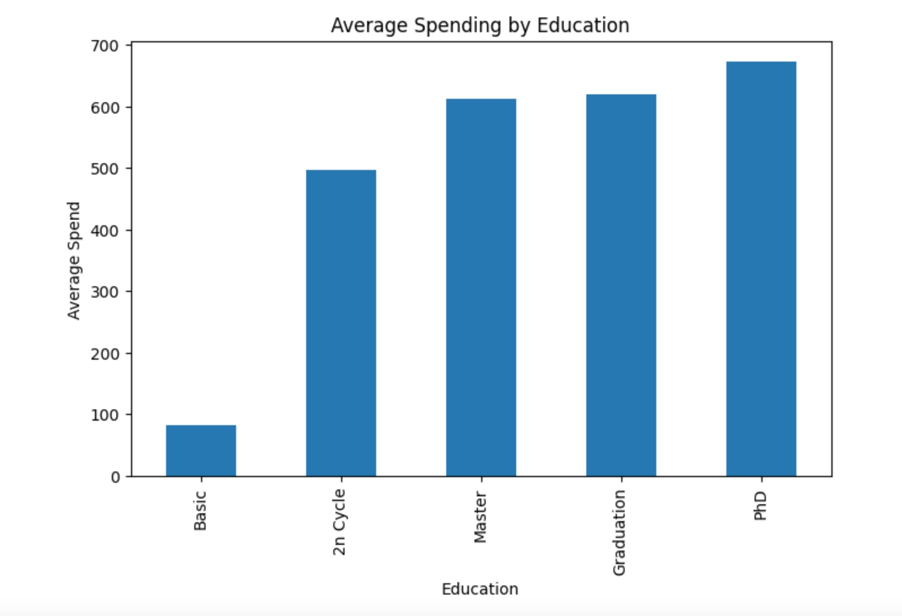

## Executive Summary

This project analyzed 2,240 customer records to understand spending behavior and marketing campaign performance.

Using exploratory data analysis and K-Means clustering, customers were segmented into three groups: Budget, Regular, and VIP customers.

The analysis found a strong positive relationship between income and spending (correlation = 0.66) and identified Campaign 4 as the highest-performing marketing campaign.

## About This Project

I built this project to practice and strengthen my data analytics skills using a real-world marketing dataset. The goal was to understand customer behavior, identify spending patterns, evaluate marketing campaign performance, and segment customers into meaningful groups.

As someone transitioning into Data Analytics with a background in Marketing Analytics, I wanted a project that combined business understanding with data analysis and machine learning.

---

## Project Objectives

Some of the questions I wanted to answer were:

* Who are the company's most valuable customers?
* Does customer income influence spending behavior?
* Which marketing campaign performed best?
* Can customers be grouped into meaningful segments for targeted marketing?

---

## Dataset

The dataset contains information on 2,240 customers, including:

* Demographic details
* Income levels
* Product purchases
* Marketing campaign responses
* Customer engagement information

---

## Tools Used

* Python
* Pandas
* NumPy
* Matplotlib
* Scikit-Learn
* Jupyter Notebook
* Git & GitHub

---

## What I Did

### Data Cleaning

* Checked the dataset structure
* Identified missing values
* Filled missing values in the Income column
* Verified duplicate records

### Feature Engineering

Created two new variables:

* **Age** (derived from Year_Birth)
* **TotalSpend** (combined spending across all product categories)

These features were later used for analysis and customer segmentation.

### Exploratory Data Analysis

I explored:

* Age distribution
* Income distribution
* Spending behavior
* Education-level spending patterns
* Campaign acceptance rates

### Correlation Analysis

I measured the relationship between Income and TotalSpend and found a correlation of **0.66**, indicating that customers with higher incomes generally tend to spend more.

### Customer Segmentation

Using K-Means Clustering, I grouped customers based on Income and TotalSpend.

While performing segmentation, I discovered an extreme income outlier that created a separate cluster by itself. After investigating and removing the outlier, I reran the model and obtained more meaningful customer segments.

---

## Key Findings

### Customer Demographics

Most customers fall within the 40–60 age range, making this the dominant customer group.

### Spending Behavior

Customers with higher incomes generally spend more, although spending habits still vary within income groups.

### Education Analysis

Customers with PhD and Master's qualifications showed the highest average spending levels.

### Campaign Performance

Among all campaigns, Campaign 4 received the highest number of customer acceptances.

### Customer Segments

After removing the outlier, three clear customer groups emerged:

| Segment           | Avg Income | Avg Spend |
| ----------------- | ---------: | --------: |
| Budget Customers  |     28,380 |        95 |
| Regular Customers |     52,415 |       500 |
| VIP Customers     |     76,968 |     1,284 |

---

## Business Recommendations

Based on the analysis:

### Budget Customers

* Focus on discounts and promotional offers
* Promote value-for-money products

### Regular Customers

* Use cross-selling and upselling strategies
* Encourage repeat purchases

### VIP Customers

* Introduce loyalty rewards
* Offer premium and exclusive products
* Prioritize customer retention efforts

---

## Visualizations

### Customer Segmentation

### Income vs Spending

### Campaign Performance

### Education Spending

---

## What I Learned

This project helped me gain hands-on experience with:

* Data cleaning and preprocessing
* Feature engineering
* Exploratory data analysis
* Data visualization
* Correlation analysis
* Customer segmentation using K-Means
* Translating analytical findings into business recommendations

---

## Author

**Amaan Shaikh**

Aspiring Data Analyst with experience in Marketing Analytics.

Currently building projects in Python, SQL, Power BI, and Data Visualization.
